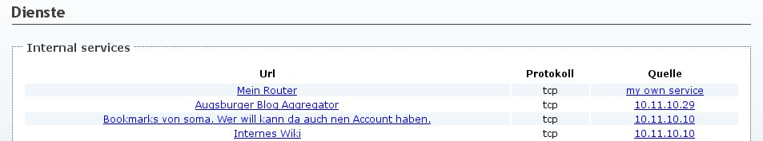

Dienste ankündigen mit dem Nameservice Plugin
=============================================

Um eigene Dienste im gesamten Mesh bekannt zu machen kann das OLSR-Nameservice
Plugin verwendet werden. Dieses sendet in regelmässigen Abständen Informationen
über die lokalen Dienste an alle anderen Nodes im Mesh.

Es können nur Service-Ankündigungen für IPs/Adressen verschickt werden, die
entweder local verwendet oder als HNA angekündigt werden.

Ist der Service unter einer DNS-Adresse bekannt, dann kann statt einer IP auch
diese Adresse in der URL des Dienstes verwendet werden.

Einrichtung
-----------

Ziel: Es soll ein Webserver auf dem lokalen Knoten mit der IP
10.11.12.13 angekündigt werden. Der Webserver läuft auf Port 80.

Einrichtung über LuCI
^^^^^^^^^^^^^^^^^^^^^

\1. Um zu den Einstellungen für das Nameservice Plugin zu kommen: Gehe zu *Dienste -> OLSR -> Plugins*

  .. image:: ../images/nameservice/nameservice-menu.jpg
     :alt: Menue Dienste -> OLSR -> Plugins

\2. Klicke in der Zeile wo olsrd_nameservice.so.0.3 steht auf "Bearbeiten"

  .. image:: ../images/nameservice/nameservice-olsr-plugins.jpg
     :alt: OLSR Plugins

\3. Füge unten aus der Auswahlbox eine Option für "Service" hinzu

  .. image:: ../images/nameservice/nameservice_add_service.jpg
     :alt: Service hinzufügen

\4. Plugin konfigurieren

  .. image:: ../images/nameservice/Nameservice-einstellungen-service.jpg
     :alt: Nameservice Plugin Einstellungen

Einrichtung mithilfe der Konsole
^^^^^^^^^^^^^^^^^^^^^^^^^^^^^^^^

.. code-block:: sh

  uci add_list olsrd.olsrd_nameservice.service="http://10.11.0.8:80|tcp|Mein Router"
  uci commit olsrd
  /etc/init.d/olsrd restart

Es können auch mehrere Dienste angekündigt werden:

.. code-block:: sh

  uci add_list olsrd.olsrd_nameservice.service="http://10.11.0.8:80|tcp|Mein Router"
  uci add_list olsrd.olsrd_nameservice.service="ftp://10.11.0.8:21|tcp|Mein FTP Server"
  uci commit olsrd
  /etc/init.d/olsrd restart

.. rubric:: Erklärung des Service Strings

Der Aufbau des erwarteten Strings als Option für Service ist recht einfach:

<url>:<port>|<Protokoll (tcp oder udp)>|<Beschreibung des Dienstes>

**Port darf nicht weggeleassen werden!**

Ergebnis
--------

Ist alles korrekt eingerichtet dann erscheint im öffentlichen Teil des 
Webinterfaces auf allen Routern im Mesh unter "Dienste" nach kurzer Zeit
die eben eingerichtete Ankündigung für "Mein Router".

