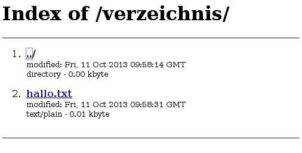

Eigene Webseiten
================

Lokal auf dem Node
------------------

Auf dem Freifunkrouter läuft ohnehin schon ein kleiner Webserver (``uhttpd``),
der verwendet werden kann um neben dem LuCI Webinterface auch eigene Inhalte per
HTTP zugänglich zu machen.

Seiten direkt über uhttpd ausliefern
^^^^^^^^^^^^^^^^^^^^^^^^^^^^^^^^^^^^

Es gibt die Möglichkeit direkt auf dem Node kleinere Seiten abzulegen, indem man
sie im Ordner /www unterbringt. Dies erfordert keine Änderung an der
Konfiguration des Nodes.

.. rubric:: Einfache statische Seite

*Beispiel:*

.. code-block:: html

  <html>
    <body>
      Hallo Welt!
    </body>
  </html>

Den obigen Code als ``/www/hallowelt.html`` abspeichern und danach im Browser
unter der Adresse ``http://<nodeip>/hallowelt.html`` aufrufen.

.. rubric:: CGI-Scripte

Möchte man CGI-Scripte ausführen, dann muss man diese in ``/www/cgi-bin``
ablegen und ausführbar machen. 

*Beispiel:*

.. code-block:: bash

  #!/bin/sh
  
  echo "Content-type: text/html"
  echo ""

  echo '
  <html>
    <head>
      <meta http-equiv="Content-Type" content="text/html; charset=UTF-8">
      <title>Hallo Welt</title>
    </head>
    <body>
      Hallo Welt!
    </body>
  </html>
  '

Den obigen Code als ``/www/cgi-bin/helloworld.cgi`` speichern und ausführbar
machen mit:

.. code-block:: bash

  chmod +x /www/cgi-bin/helloworld.cgi

Dieses Testscript kann nun im Browser unter

``http://<nodeip>/cgi-bin/helloworld.cgi``

abgerufen werden.

Das selbe Script in Lua:

.. code-block:: lua

  #!/usr/bin/lua

  print("Content-type: text/html")
  print("")

  print ([[
  <html>
    <head>
      <meta http-equiv="Content-Type" content="text/html; charset=UTF-8">
      <title>Hello World</title>
    </head>
    <body>
      Hallo Welt!
    </body>
  </html>
  ]])

Verzeichnisinhalte
^^^^^^^^^^^^^^^^^^

In der Standardkonfiguration zeigt uhttpd auch Verzeichnisinhalte von
Verzeichnissen an, die keine index-Datei enthalten.

*Beispiel:*

.. code-block:: bash

  mkdir /www/verzeichnis
  echo "hallo" > /www/verzeichnis/hallo.txt

Öffnet man im Browser jetzt http://<nodeip>/verzeichnis, dann erhält man
folgende Ausgabe:

Auf einem seperaten PC/Server
-----------------------------

Soll die Webseite von einem anderen PC bzw. Server ausgeliefert werden,
der per Netzwerk mit dem Node verbunden ist gibt es mehrere Möglichkeiten,
diese Inhalte im Freifunknetz verfügbar zu machen, siehe dazu:
:ref:`integrate_other_pcs`
