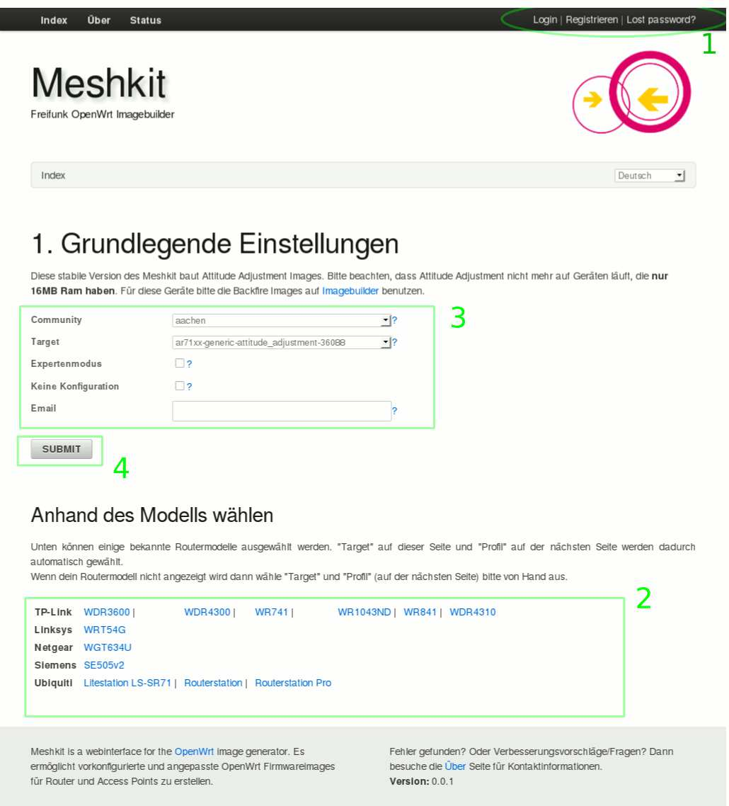

.. include:: links.txt

Firmware mit Meshkit generieren lassen
======================================

.. _`Infos zum Router sammeln`:

Wichtige Infos zum Router sammeln
---------------------------------

Um eine passende Firmware für das eigene Routermodell zu generieren muss man
zunächst einige Daten zum Router kennen:

* Chipsatz
* Chipsatz des/der WLAN-Interfaces
* Größe des RAM
* Größe des Flash-Speichers

Diese Daten finden man in der `Table of Hardware`_ im OpenWrt Wiki. Zu den
meisten Routermodellen gibt es auch eine Detailseite mit weiteren Infos. Diese
Seite sollte man ebenfalls zumindest kurz überfliegen. Hier finden sich
im Allgemeinen auch Infos zum Flashen und zur Rettung des Routers falls beim 
Flashen etwas so richtig schief ging.

Beispiel:

Wir wollen die Daten für einen TP-Link WR1043ND zusammentragen. In der
`Table of Hardware`_ sehen wir folgendes:

.. image:: images/toh-wr1043nd.jpg

Daraus können wir entnehmen:

* Der Chipsatz gehört zur AR71XX Familie
* WLAN benutzt Atheros Hardware
* Der RAM ist 32 MB groß
* Flash ist 8 MB groß

IP-Adresse(n) registrieren
--------------------------

Nun muss noch mindestens eine IP-Adresse aus dem Freifunknetz für den Router
registriert werden. Hier hat jede Community ihre eigenen Seiten zur Registrierung,
im Allgemeinen kann man sich hier jedoch selbst bedienen und einfach eine noch
nicht vergebene Adresse für seinen Knoten reservieren.

Registrierungsseiten in den einzelnen Communities:

* **Augsburg:** Als Benutzer auf http://augsburg.freifunk.net einloggen und "Node registrieren"

Firmware generieren
-------------------

Das Erstellen von Firmwareimages erfolgt in drei Schritten:

Grundlegende Systemeinstellungen
^^^^^^^^^^^^^^^^^^^^^^^^^^^^^^^^

Öffne die Meshkit_ Webseite im Browser. Du siehst nun folgendes:

*Erklärung:*

1. Login bzw. Registrieren

    Hier kann man einen User für Meshkit registrieren. Dadurch wird es möglich,
    einige Datenfelder beim Generieren neuer Images bereits auszufüllen, z.B.
    Community, Adresse oder SSH Public Keys. Es ist nicht notwendig einen Benutzer
    im Meshkit zu registrieren. Wer aber öfter Images generiert dem kann
    die Registrierung ersparen, bei einigen Feldern immer und immer wieder die
    selben Daten einzugeben.

2. Geräte Vorauswahl

    Im unteren Bereich von Meshkit befinden sich einige Links zu Geräten, die
    häufig verwendet werden. Klickt man auf einen dieser links, dann wählt Meshkit
    automatisch das richtige Target (und in Schritt 2 auch das passende Profil) für
    dieses Gerät. Wenn ein Gerät nicht in dieser Liste steht dann heisst das nicht,
    dass es nicht unterstützt wird, sondern nur, dass man Target und im nächsten
    Schritt Profil manuell auswählen muss.

3. Einstellungen

    .. list-table::
       :widths: 25 75
       :header-rows: 1

       * - Option
         - Beschreibung
       * - Community
         - Wähle deine Community aus. (TODO: Was tun wenn es noch keine gibt?)
       * - Target
         - Wähle ein passendes Target (siehe `Infos zum Router sammeln`_)
       * - Expertenmodus
         - Wenn ausgewählt, dann werden im nächsten Schritt wesentlich mehr Optionen
           zur Konfiguration des Routers angezeigt.
       * - Keine Konfiguration
         - Erstellt ein Image, es wird aber keine Konfiguration durchgeführt. Dies
           ist vor allem nützlich um Images zu erhalten, die für sysupgrade (TODO:
           Seite zu sysupgrade anlegen) verwendet werden können.
       * - Email
         - Wenn angegeben wird nachdem das Image gebaut wurde eine Mail an diese
           Adresse geschickt.

4. Absenden

    Nachdem alle Einstellungen getätigt wurde klicke auf **Absenden** um zu
    Schritt 2 des Meshkits zu gelangen, wo weitere Einstellungen vorgenommen
    werden müssen.

